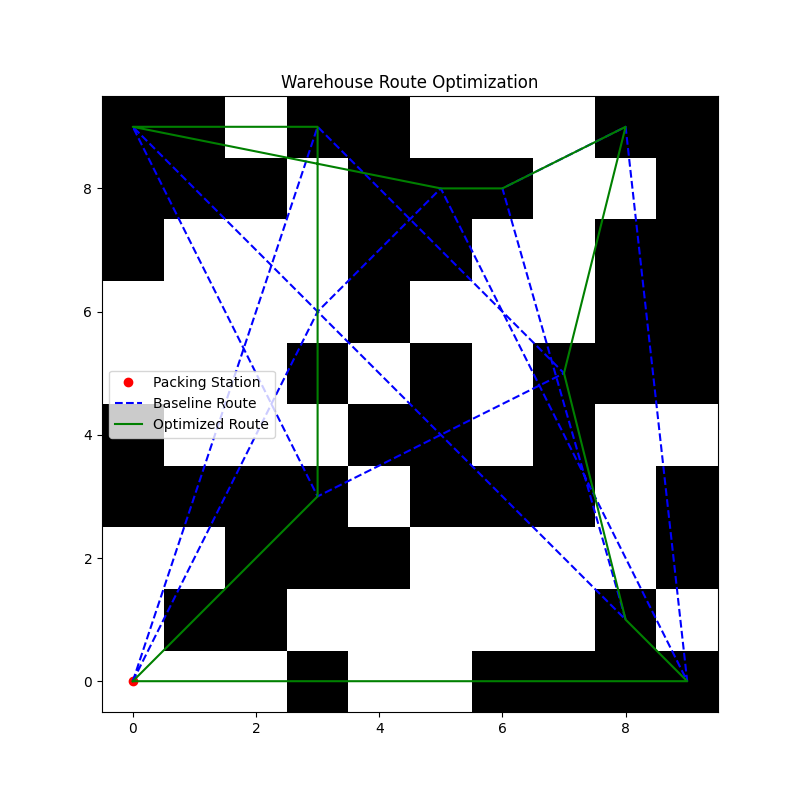
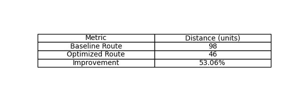
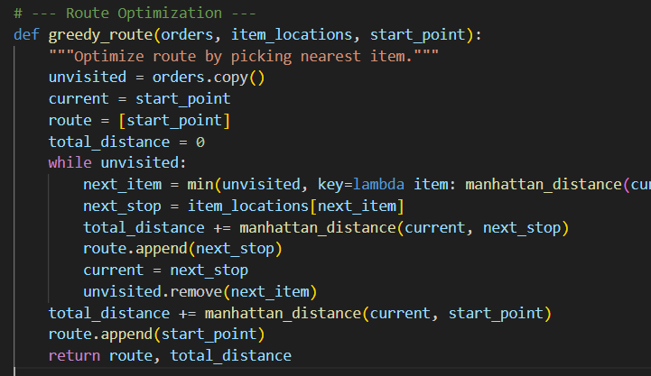

# AI-Driven Warehouse Route Optimization
## Overview
A Python-based simulation to optimize order-picking routes in a 10x10 warehouse, reducing travel distance by [Your Improvement]% using a greedy algorithm. Demonstrates Industrial and Systems Engineering skills in optimization, simulation, and logistics.

## Problem
Minimize travel distance for pickers fulfilling 10 random orders in a warehouse with 50 shelves and 100 items.

## Solution
- Modeled a warehouse grid using NumPy.
- Implemented a greedy algorithm to select the nearest item at each step.
- Visualized baseline vs. optimized routes with Matplotlib.

## Results
| Metric            | Distance (units) |
|-------------------|------------------|
| Baseline Route    | [Your Baseline]  |
| Optimized Route   | [Your Optimized] |
| Improvement       | [Your %]         |





## Tools
- Python, NumPy, Matplotlib, Pandas

## Installation
```bash
pip install numpy matplotlib pandas
python warehouse_opt.py# warehouse-optimization
Python-based warehouse route optimizer reducing picker travel distance.
